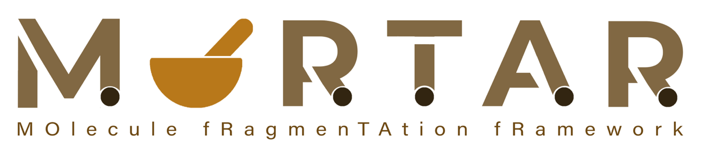

# MOlecule fRagmenTAtion fRamework (MORTAR)

 

## Contents of this document
* [Description](#Description)
* [Contents of this repository](#Contents-of-this-repository)
  * [Sources](#Sources)
  * [Tutorial](#Tutorial)
  * [Images](#Images)
* [Installation](#Installation)
    * [Application](#Application)
    * [Source code](#Source-code)
* [Dependencies](#Dependencies)
* [Citation](#Citation)
* [References and useful links](#References-and-useful-links)
* [Acknowledgements](#Acknowledgements)

## Description
MORTAR ('MOlecule fRagmenTation fRamework') is an open software project that supports workflows of
molecular fragmentation and substructure analysis. The Java/JavaFX rich-client application offers extensive graphical 
functions for visualising the fragmentation results of individual compounds or entire compound sets. With several 
views and analysis functions, MORTAR supports the interpretation of fragmentation results. In addition to three 
currently integrated methods for fragmentation and substructure analysis - 
<a href="https://github.com/JonasSchaub/ErtlFunctionalGroupsFinder">ErtlFunctionalGroupsFinder</a>, 
<a href="https://github.com/JonasSchaub/SugarRemoval">Sugar Removal Utility</a>, 
and <a href="https://github.com/cdk/cdk-scaffold">CDK-Scaffold</a> - MORTAR allows straightforward integration of 
additional fragmentation algorithms with automatic generation of settings 
menus. All cheminformatics functionalities are implemented based on the <a href="https://github.com/cdk/cdk">Chemistry Development Kit (CDK)</a>. 
The scientific article describing MORTAR can be found here: 
<a href="https://doi.org/10.1186/s13321-022-00674-9"> MORTAR: a rich client application for in silico molecule fragmentation (Baensch et al. 2023) </a>

## Contents of this repository
### Sources
The <a href="https://github.com/FelixBaensch/MORTAR/tree/main/src">"src"</a> subfolder contains all source code packages including JUnit tests.

### Tutorial
The <a href="https://github.com/FelixBaensch/MORTAR/tree/main/Tutorial">"Tutorial" folder</a> contains a PDF document 
with a detailed tutorial on how to install and use MORTAR, together with
a test data set. 

### Images
The <a href="https://github.com/FelixBaensch/MORTAR/tree/main/Images">"Images" folder</a> contains the MORTAR logo and 
icon as image files that were created by <a href="https://github.com/Kohulan">Kohulan Rajan</a>.
If you are using MORTAR for your own projects, feel free to acknowledge it by using the logo in your presentations etc.

## Installation
### Application
Pre-compiled and executable MORTAR distributions can be found attached to the 
<a href="https://github.com/FelixBaensch/MORTAR/releases">marked releases</a>.

<b>Windows:</b> A convenient Windows OS installer executable for MORTAR is available 
(click <a href="https://github.com/FelixBaensch/MORTAR/releases/download/v1.1.1.0/MORTAR_v1.1.1.0_WINx64_installer.exe">here</a> to 
automatically download the installer .exe of the latest version). Download the installer 
executable, start, and follow the instructions to install MORTAR. Note that the installation includes a full 
Java Runtime Environment (JRE). After installation, create a shortcut to an appropriate MORTAR start batch file on your 
Windows desktop. E.g. for MORTAR to use up to 4 gigabyte of RAM, copy a shortcut to batch file "MORTAR.bat" which is 
located in the MORTAR program folder (default "C:\Program Files\MORTAR\MORTARv1.1.1.0\bin" or the path specified at 
installation). To start MORTAR, double-click the created shortcut. MORTAR can be uninstalled by the provided 
Uninstall.exe executable in the MORTAR program folder or standard Windows functions.
 
As an alternative to "MORTAR.bat", there is also the "MORTAR_20GB.bat" batch file available that allocates up to 
20 GB of RAM for MORTAR. If you want to configure your own heap space settings, open one of the provided batch files 
and adjust the line

<code>set DEFAULT_JVM_OPTS="-Xms4g" "-Xmx4g"</code>

with your chosen initially allocated memory (-Xms) and maximum value (-Xmx) accordingly. 

Should this installation or the execution of the batch files not work for you, try the guidelines for Linux and MaxOS 
described below. As an alternative way, they should also work on Windows.

<b>Linux and macOS:</b> Every release has the executable Java ARchive (JAR) "MORTAR-fat-1.1.1.0.jar"
attached, which contains the packaged MORTAR code together with all dependencies 
(click <a href="https://github.com/FelixBaensch/MORTAR/releases/download/v1.1.1.0/MORTAR-fat-1.1.1.0.jar">here</a> to 
automatically download the JAR of the latest version). 
To run MORTAR (with up to 4 GB of RAM available, e.g.), 
execute the JAR from the command-line using

<code>java -jar -Xms512m -Xmx4g [path to]MORTAR-fat-1.1.1.0.jar</code>

A JDK or JRE of version 17.0.4 or higher (v21.0.1 for the upcoming release) needs to be installed on your system and linked to the "java" command. 
Otherwise, replace "java" with the path to the java command of your JDK or JRE. 

Please note that MORTAR only supports x64 (on all three platforms) and AArch64 (on macOS and Linux) architectures in general. 
For the latter, a special "fat JAR" named "MORTAR-fat-aarch64-1.1.1.0.jar" is available from the distributions attached to the releases and must be used 
(click <a href="https://github.com/FelixBaensch/MORTAR/releases/download/v1.1.1.0/MORTAR-fat-aarch64-1.1.1.0.jar">here</a> to 
automatically download the AArch64 JAR of the latest version).

Also note that using the Windows Subsystem for Linux (WSL) is not recommended, since a lot of additional configurations 
have to be made there to run Java GUI applications.

### Source code
This is a Gradle project. In order to use the source code for your own software or do your own MORTAR build, download or 
clone the repository and open it in a Gradle-supporting IDE (e.g. IntelliJ) as a Gradle project and execute the 
build.gradle file. Gradle will then take care of installing all dependencies. A Java Development Kit (JDK) of version 21.0.1 
or higher must also be pre-installed and set as project JDK / project compiler.
The Gradle build process is configured to include a specific Java Runtime Environment (JRE) in the "install" folder.
For this to work, you need to create an "AdoptOpenJDK\jdk-21.0.1_12_jre\" folder and put the JRE with the specified version 
into it (i.e. sub-folders of "AdoptOpenJDK\jdk-21.0.1_12_jre\" need to be "bin", "conf", "legal", "lib", etc.).

## Dependencies
**Needs to be pre-installed:**
* Java Development Kit (JDK) version 21.0.1 or higher
    * [Adoptium Open JDK](https://adoptium.net) (as one possible source of the JDK)
* Gradle version 8.5
    * [Gradle Build Tool](https://gradle.org)

**Managed by Gradle:**
* JavaFX version 21.0.1
  * [Open JavaFX](https://openjfx.io)
  * GNU General Public License (GPL) Version 2
* Chemistry Development Kit (CDK) version 2.9
    * [Chemistry Development Kit on GitHub](https://cdk.github.io/)
    * License: GNU Lesser General Public License 2.1
* JUnit version 5.9.3
    * [JUnit 5](https://junit.org/junit5/)
    * License: Eclipse Public License 2.0
* LibrePDF OpenPDF version 1.3.26
  * [OpenPDF GitHub repository](https://github.com/LibrePDF/OpenPDF)
  * License: GNU Lesser General Public License 2.1
* Spotless version 6.23
  * [Spotless GitHub repository](https://github.com/diffplug/spotless)
  * License: Apache-2.0 license

## Citation
You can cite this software or this repository as it is defined in the CITATION.cff file. Also, please cite our scientific 
article (<a href= "https://doi.org/10.1186/s13321-022-00674-9"> MORTAR: a rich client application for in silico molecule 
fragmentation (Baensch et al. 2023)).

## References and useful links
**Ertl algorithm**
* [Ertl P. An algorithm to identify functional groups in organic molecules. J Cheminform. 2017; 9:36.](https://doi.org/10.1186/s13321-017-0225-z)
* [Fritsch S, Neumann S, Schaub J, Steinbeck C, Zielesny A. ErtlFunctionalGroupsFinder: automated rule-based functional group detection with the Chemistry Development Kit (CDK). J Cheminform. 2019; 11:37](https://doi.org/10.1186/s13321-019-0361-8)
* [ErtlFunctionalGroupsFinder on GitHub](https://www.github.com/zielesny/ErtlFunctionalGroupsFinder)

**Sugar Removal Utility**
* [Schaub, J., Zielesny, A., Steinbeck, C., Sorokina, M. Too sweet: cheminformatics for deglycosylation in natural products. J Cheminform 12, 67 (2020). https://doi.org/10.1186/s13321-020-00467-y](https://doi.org/10.1186/s13321-020-00467-y)
* [Schaub, J., Zielesny, A., Steinbeck, C., Sorokina, M. Description and Analysis of Glycosidic Residues in the Largest Open Natural Products Database. Biomolecules 2021, 11, 486. https://doi.org/10.3390/biom11040486](https://doi.org/10.3390/biom11040486)
* [SRU Source code](https://github.com/JonasSchaub/SugarRemoval)
* [Sugar Removal Web Application](https://sugar.naturalproducts.net)
* [Source Code of Web Application](https://github.com/mSorok/SugarRemovalWeb)

**Scaffold Generator**
* [Schaub, J., Zander, J., Zielesny, A., Steinbeck, C. Scaffold Generator: a Java library implementing molecular scaffold functionalities in the Chemistry Development Kit (CDK). J Cheminform 14, 79 (2022). https://doi.org/10.1186/s13321-022-00656-x.](https://doi.org/10.1186/s13321-022-00656-x)
* [G. W. Bemis and M. A. Murcko, “The Properties of Known Drugs. 1. Molecular Frameworks,” J. Med. Chem., vol. 39, no. 15, pp. 2887–2893, Jan. 1996, doi: 10.1021/jm9602928.](https://doi.org/10.1021/jm9602928)
* [S. J. Wilkens, J. Janes, and A. I. Su, “HierS: Hierarchical Scaffold Clustering Using Topological Chemical Graphs,” J. Med. Chem., vol. 48, no. 9, pp. 3182–3193, May 2005, doi: 10.1021/jm049032d.](https://doi.org/10.1021/jm049032d)
* [M. A. Koch et al., “Charting biologically relevant chemical space: A structural classification of natural products (SCONP),” Proceedings of the National Academy of Sciences, vol. 102, no. 48, pp. 17272–17277, Nov. 2005, doi: 10.1073/pnas.0503647102.](https://doi.org/10.1073/pnas.0503647102)
* [A. Schuffenhauer, P. Ertl, S. Roggo, S. Wetzel, M. A. Koch, and H. Waldmann, “The Scaffold Tree − Visualization of the Scaffold Universe by Hierarchical Scaffold Classification,” J. Chem. Inf. Model., vol. 47, no. 1, pp. 47–58, Jan. 2007, doi: 10.1021/ci600338x.](https://doi.org/10.1021/ci600338x)
* [T. Varin et al., “Compound Set Enrichment: A Novel Approach to Analysis of Primary HTS Data,” J. Chem. Inf. Model., vol. 50, no. 12, pp. 2067–2078, Dec. 2010, doi: 10.1021/ci100203e.](https://doi.org/10.1021/ci100203e)
* [T. Varin, A. Schuffenhauer, P. Ertl, and S. Renner, “Mining for Bioactive Scaffolds with Scaffold Networks: Improved Compound Set Enrichment from Primary Screening Data,” J. Chem. Inf. Model., vol. 51, no. 7, pp. 1528–1538, Jul. 2011, doi: 10.1021/ci2000924.](https://doi.org/10.1021/ci2000924)
* [C. Manelfi et al., “‘Molecular Anatomy’: a new multi-dimensional hierarchical scaffold analysis tool,” J Cheminform, vol. 13, no. 1, p. 54, Dec. 2021, doi: 10.1186/s13321-021-00526-y.](https://doi.org/10.1186/s13321-021-00526-y)

**Chemistry Development Kit (CDK)**
* [Chemistry Development Kit on GitHub](https://cdk.github.io/)
* [Steinbeck C, Han Y, Kuhn S, Horlacher O, Luttmann E, Willighagen EL. The Chemistry Development Kit (CDK): An Open-Source Java Library for Chemo- and Bioinformatics. J Chem Inform Comput Sci. 2003;43(2):493-500.](https://dx.doi.org/10.1021%2Fci025584y)
* [Steinbeck C, Hoppe C, Kuhn S, Floris M, Guha R, Willighagen EL. Recent Developments of the Chemistry Development Kit (CDK) - An Open-Source Java Library for Chemo- and Bioinformatics. Curr Pharm Des. 2006; 12(17):2111-2120.](https://doi.org/10.2174/138161206777585274)
* [May JW and Steinbeck C. Efficient ring perception for the Chemistry Development Kit. J. Cheminform. 2014; 6:3.](https://dx.doi.org/10.1186%2F1758-2946-6-3)
* [Willighagen EL, Mayfield JW, Alvarsson J, Berg A, Carlsson L, Jeliazkova N, Kuhn S, Pluskal T, Rojas-Chertó M, Spjuth O, Torrance G, Evelo CT, Guha R, Steinbeck C, The Chemistry Development Kit (CDK) v2.0: atom typing, depiction, molecular formulas, and substructure searching. J Cheminform. 2017; 9:33.](https://doi.org/10.1186/s13321-017-0220-4)
* [Groovy Cheminformatics with the Chemistry Development Kit](https://github.com/egonw/cdkbook)

## Acknowledgements
**Developers:**
* Felix Baensch
* Jonas Schaub
* Betuel Sevindik
* Samuel Behr
* Julian Zander

**Logo:**
* Kohulan Rajan

**Initialization, conceptualization, and supervision:**
* Christoph Steinbeck and Achim Zielesny

**MORTAR was developed at:**
 
 Zielesny Research Group
 Westphalian University of Applied Sciences
 August-Schmidt-Ring 10
 D-45665 Recklinghausen Germany
 
 and
 
 Steinbeck Research Group
 Institute for Inorganic and Analytical Chemistry
 Friedrich-Schiller-University Jena
 Lessingstraße 8
 D-07743 Jena

**The MORTAR project team would like to thank the communities behind the open software libraries the application employs 
for their amazing work.**
