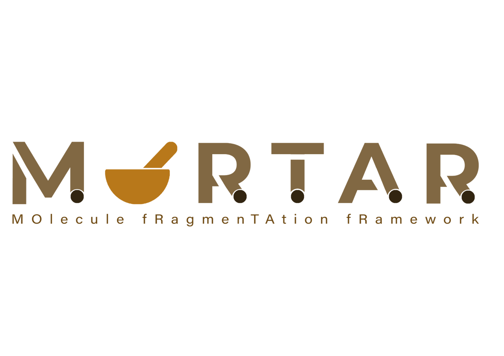

# MORTAR
##### MOlecule fRagmenTAtion fRamework

## Contents of this document
* [Description](#Description)
* [Contents of this repository](#Contents-of-this-repository)
  * [Sources](#Sources)
* [Installation](#Installation)
    * [Application](#Application)
    * [Source code](#Source-code)
* [Dependencies](#Dependencies)
* [References and useful links](#References-and-useful-links)
* [Acknowledgements](#Acknowledgements)

## Description
TODO

## Contents of this repository
### Sources
TODO

## Installation
### Application
TODO

### Source code
TODO

## Dependencies
**Needs to be pre-installed:**
* Java Development Kit (JDK) version 11 TODO
    * [AdoptOpenJDK](https://adoptopenjdk.net) (as one possible source of the JDK)
* Gradle version TODO
    * 

**Managed by Gradle:** TODO
* Chemistry Development Kit (CDK) version 2.7.1
    * [Chemistry Development Kit on GitHub](https://cdk.github.io/)
    * License: GNU Lesser General Public License 2.1
* JUnit version 4.13.2
    * [JUnit 4](https://junit.org/junit4/)
    * License: Eclipse Public License 1.0

## References and useful links
**Ertl algorithm**
* [Ertl P. An algorithm to identify functional groups in organic molecules. J Cheminform. 2017; 9:36.](https://doi.org/10.1186/s13321-017-0225-z)
* [Fritsch S, Neumann S, Schaub J, Steinbeck C, Zielesny A. ErtlFunctionalGroupsFinder: automated rule-based functional group detection with the Chemistry Development Kit (CDK). J Cheminform. 2019; 11:37](https://doi.org/10.1186/s13321-019-0361-8)
* [ErtlFunctionalGroupsFinder on GitHub](https://www.github.com/zielesny/ErtlFunctionalGroupsFinder)

**Sugar Removal Utility**
* [Schaub, J., Zielesny, A., Steinbeck, C., Sorokina, M. Too sweet: cheminformatics for deglycosylation in natural products. J Cheminform 12, 67 (2020). https://doi.org/10.1186/s13321-020-00467-y](https://doi.org/10.1186/s13321-020-00467-y)
* [Schaub, J., Zielesny, A., Steinbeck, C., Sorokina, M. Description and Analysis of Glycosidic Residues in the Largest Open Natural Products Database. Biomolecules 2021, 11, 486. https://doi.org/10.3390/biom11040486](https://doi.org/10.3390/biom11040486)
* [SRU Source code](https://github.com/JonasSchaub/SugarRemoval)
* [Sugar Removal Web Application](https://sugar.naturalproducts.net)
* [Source Code of Web Application](https://github.com/mSorok/SugarRemovalWeb)

**Scaffold Generator**
* [J. Schaub, J. Zander, A. Zielesny, and C. Steinbeck, ‘Scaffold Generator - A Java library implementing molecular scaffold functionalities in the Chemistry Development Kit (CDK)’, Chemistry, preprint, Mar. 2022. doi: 10.26434/chemrxiv-2022-7tf0h.](https://doi.org/10.26434/chemrxiv-2022-7tf0h)
* [G. W. Bemis and M. A. Murcko, “The Properties of Known Drugs. 1. Molecular Frameworks,” J. Med. Chem., vol. 39, no. 15, pp. 2887–2893, Jan. 1996, doi: 10.1021/jm9602928.](https://doi.org/10.1021/jm9602928)
* [S. J. Wilkens, J. Janes, and A. I. Su, “HierS: Hierarchical Scaffold Clustering Using Topological Chemical Graphs,” J. Med. Chem., vol. 48, no. 9, pp. 3182–3193, May 2005, doi: 10.1021/jm049032d.](https://doi.org/10.1021/jm049032d)
* [M. A. Koch et al., “Charting biologically relevant chemical space: A structural classification of natural products (SCONP),” Proceedings of the National Academy of Sciences, vol. 102, no. 48, pp. 17272–17277, Nov. 2005, doi: 10.1073/pnas.0503647102.](https://doi.org/10.1073/pnas.0503647102)
* [A. Schuffenhauer, P. Ertl, S. Roggo, S. Wetzel, M. A. Koch, and H. Waldmann, “The Scaffold Tree − Visualization of the Scaffold Universe by Hierarchical Scaffold Classification,” J. Chem. Inf. Model., vol. 47, no. 1, pp. 47–58, Jan. 2007, doi: 10.1021/ci600338x.](https://doi.org/10.1021/ci600338x)
* [T. Varin et al., “Compound Set Enrichment: A Novel Approach to Analysis of Primary HTS Data,” J. Chem. Inf. Model., vol. 50, no. 12, pp. 2067–2078, Dec. 2010, doi: 10.1021/ci100203e.](https://doi.org/10.1021/ci100203e)
* [T. Varin, A. Schuffenhauer, P. Ertl, and S. Renner, “Mining for Bioactive Scaffolds with Scaffold Networks: Improved Compound Set Enrichment from Primary Screening Data,” J. Chem. Inf. Model., vol. 51, no. 7, pp. 1528–1538, Jul. 2011, doi: 10.1021/ci2000924.](https://doi.org/10.1021/ci2000924)
* [C. Manelfi et al., “‘Molecular Anatomy’: a new multi-dimensional hierarchical scaffold analysis tool,” J Cheminform, vol. 13, no. 1, p. 54, Dec. 2021, doi: 10.1186/s13321-021-00526-y.](https://doi.org/10.1186/s13321-021-00526-y)

**Chemistry Development Kit (CDK)**
* [Chemistry Development Kit on GitHub](https://cdk.github.io/)
* [Steinbeck C, Han Y, Kuhn S, Horlacher O, Luttmann E, Willighagen EL. The Chemistry Development Kit (CDK): An Open-Source Java Library for Chemo- and Bioinformatics. J Chem Inform Comput Sci. 2003;43(2):493-500.](https://dx.doi.org/10.1021%2Fci025584y)
* [Steinbeck C, Hoppe C, Kuhn S, Floris M, Guha R, Willighagen EL. Recent Developments of the Chemistry Development Kit (CDK) - An Open-Source Java Library for Chemo- and Bioinformatics. Curr Pharm Des. 2006; 12(17):2111-2120.](https://doi.org/10.2174/138161206777585274)
* [May JW and Steinbeck C. Efficient ring perception for the Chemistry Development Kit. J. Cheminform. 2014; 6:3.](https://dx.doi.org/10.1186%2F1758-2946-6-3)
* [Willighagen EL, Mayfield JW, Alvarsson J, Berg A, Carlsson L, Jeliazkova N, Kuhn S, Pluska T, Rojas-Chertó M, Spjuth O, Torrance G, Evelo CT, Guha R, Steinbeck C, The Chemistry Development Kit (CDK) v2.0: atom typing, depiction, molecular formulas, and substructure searching. J Cheminform. 2017; 9:33.](https://doi.org/10.1186/s13321-017-0220-4)
* [Groovy Cheminformatics with the Chemistry Development Kit](https://github.com/egonw/cdkbook)

## Acknowledgements
**Developers:**
* Felix Baensch
* Jonas Schaub
* Betül Sevindik
* Samuel Behr
* Julian Zander

**Logo:**
* Kohulan Rajan

**Initialization, conceptualization, and supervision:**
* Christoph Steinbeck and Achim Zielesny

**The MORTAR project team would like to thank the communities behind the open software libraries the application employs 
for their amazing work.**
